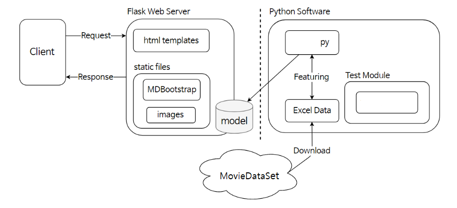
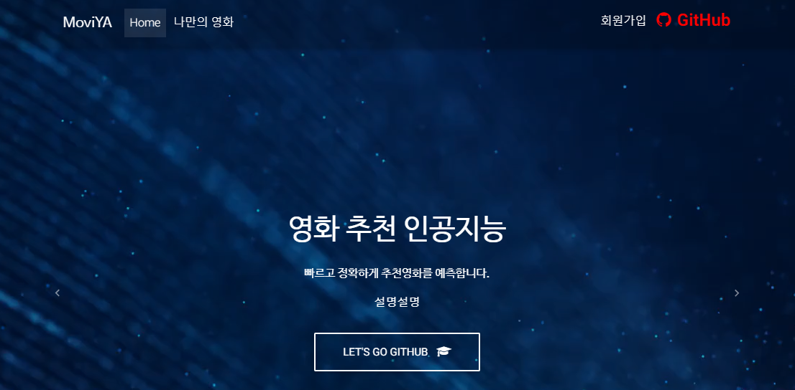
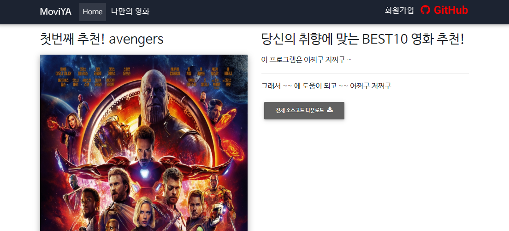

# MoviYA
- **파이썬 인공지능**을 이용한 영화 추천 웹앱
- 이 프로젝트는 **앱 해상도에 최적화** 되어있습니다.

## 시스템구성도


## Web Site


<br>
참조 : https://mdbootstrap.com/freebies/
<br>
참조 : https://mdbootstrap.com/plugins/jquery/video/

## 모바일ver.


## 서버 실행
```
# 깃 허브에서 소스코드를 다운로드 받습니다.
git clone https://github.com/pym7857/MoviYA.git

# 받은 프로젝트 폴더로 이동합니다.
cd MoviYA

# 플라스크 웹 서버 폴더로 이동합니다.
cd "Web"

# 웹 서버를 실행합니다.
python server.py
```

## 패치노트
```
- 로그인/회원가입
- Refine DataSet
- Pearson Correlation (피어슨 상관관계) 적용
```

## 파이썬 데이터 학습 모델 생성 ( 옵션 )
```
# 프로젝트 폴더에서 파이썬 폴더로 이동합니다.
cd "Python Code"

# 엑셀(Excel) 파일로 학습을 수행합니다.
python offline_save.py

# (옵션) 학습된 데이터를 확인합니다.
python "user_input.py"
>> 입력1: -2.7
>> 입력2: -6.5
>> 입력3: 2.0
>> 입력4:  0.1
[2000.2086]

# 이후에 생성된 모델 파일을 웹 서버의 model 폴더에 붙여넣기 하면 적용됩니다.
```

## 참고
- 회원가입 snippet : https://bootsnipp.com/snippets/orMGB
- 로그인 snippet : https://bootsnipp.com/snippets/vl4R7
